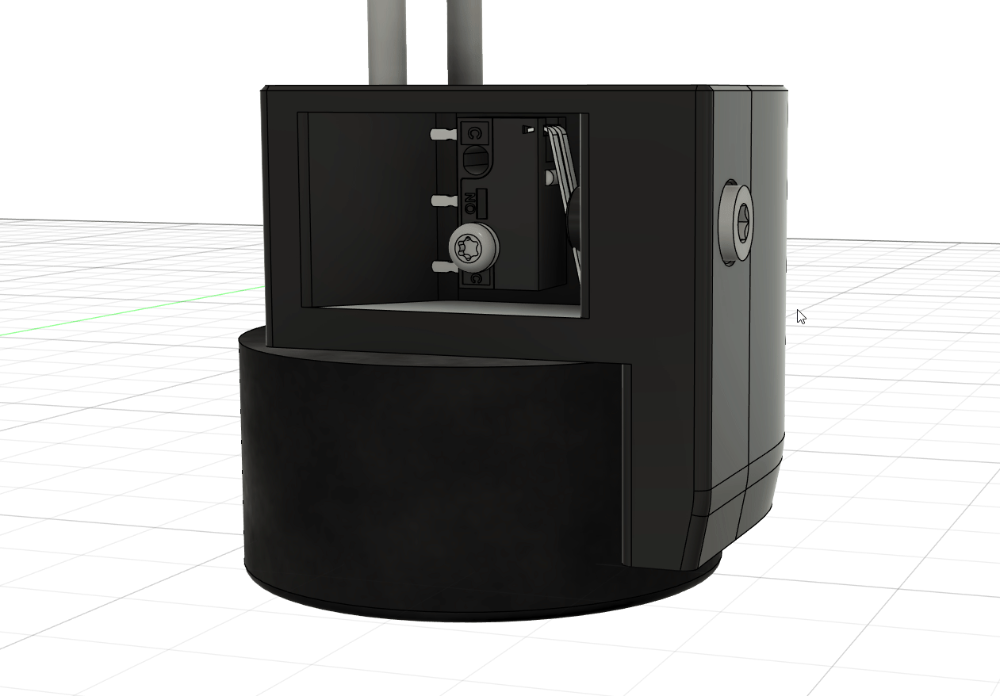

# Button Corner



This mods adds a stealthy integrated button into a skirt corner. In addition to the parts required for a regular skirt corner, this mod requires:

| Part | Quantity |
|:-|:-:|
| M3x10 SHCS | 1 |
| M2x10 self tapper | 1 |
| 3mm ID x 4mm OD x 7mm length PTFE tube | 1 |
| D2F-L microswitch | 1 |

## Klipper configuration

This sample configuration can be used to customize the behavior of single, double, triple, and long presses of the button.

```
[gcode_button action]
pin: # INSERT PIN.
press_gcode: _ACTION_PRESS
release_gcode: _ACTION_RELEASE

[gcode_macro ACTION_BUTTON]
variable_count: 0
variable_delay = 0.2
variable_long = 1.0
gcode:
    
    
        # INSERT LONG PRESS GCODE.
    
        
            # INSERT SINGLE PRESS GCODE.
        
        
            # INSERT DOUBLE PRESS GCODE.
        
        
            # INSERT TRIPLE PRESS GCODE.
        
    

[gcode_macro _ACTION_PRESS]
gcode:
    
    _ACTION_CANCEL_DELAY
    SET_GCODE_VARIABLE MACRO=ACTION_BUTTON VARIABLE=count VALUE={vars.count|int + 1}
    UPDATE_DELAYED_GCODE ID=_ACTION_LONG_EXECUTE DURATION={vars.long}

[gcode_macro _ACTION_RELEASE]
gcode:
    
    _ACTION_CANCEL_DELAY
    UPDATE_DELAYED_GCODE ID=_ACTION_EXECUTE DURATION={vars.delay}

[gcode_macro _ACTION_RESET]
gcode:
    SET_GCODE_VARIABLE MACRO=ACTION_BUTTON VARIABLE=count VALUE=0

[gcode_macro _ACTION_CANCEL_DELAY]
gcode:
    UPDATE_DELAYED_GCODE ID=_ACTION_EXECUTE DURATION=0
    UPDATE_DELAYED_GCODE ID=_ACTION_LONG_EXECUTE DURATION=0

[delayed_gcode _ACTION_EXECUTE]
gcode:
    _ACTION_CANCEL_DELAY
    ACTION_BUTTON
    _ACTION_RESET

[delayed_gcode _ACTION_LONG_EXECUTE]
gcode:
    _ACTION_CANCEL_DELAY
    ACTION_BUTTON LONG=1
    _ACTION_RESET
```
