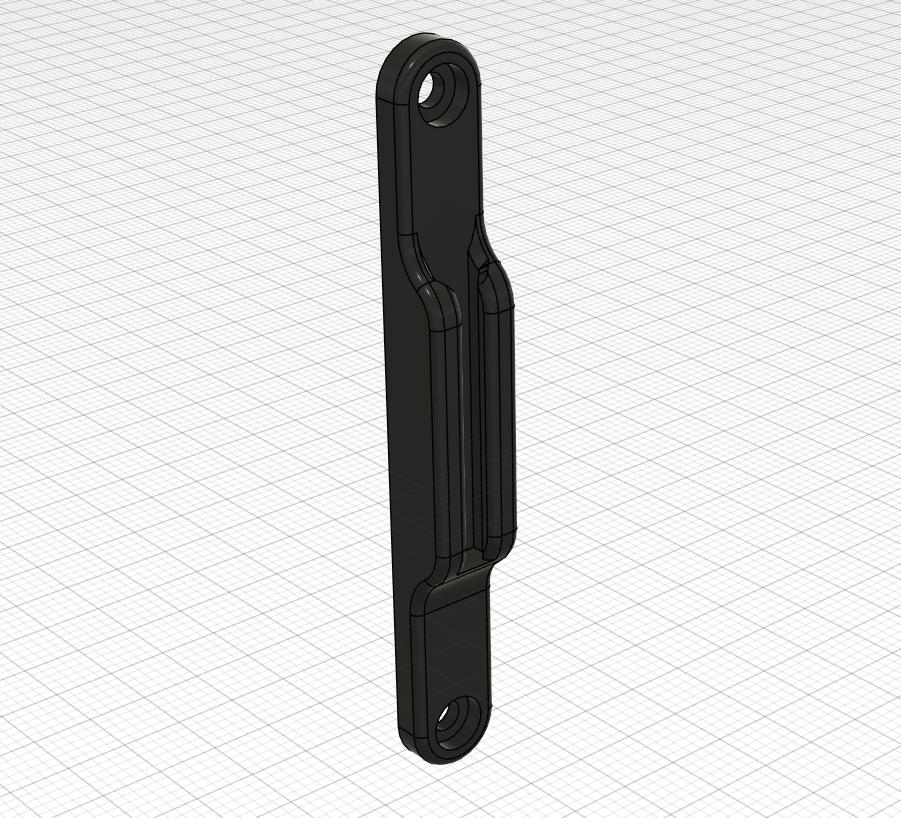

# Micron Spool Holder

This is a mount for the removable spool holder from [Micron R1](https://github.com/PrintersForAnts/Micron). It mounts to the back panel of the printer, similar to the reverse Bowden holder.

| Part | Quantity |
|:-|:-:|
| M3x12 BHCS | 2 |
| 2mm ID x 4mm OD x 87mm PTFE tube | 1 |
